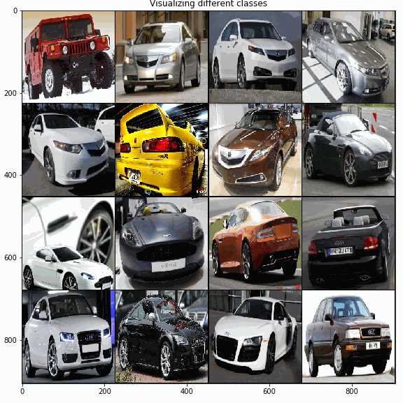
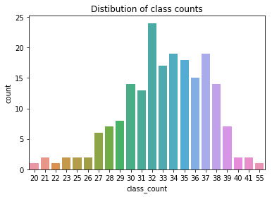
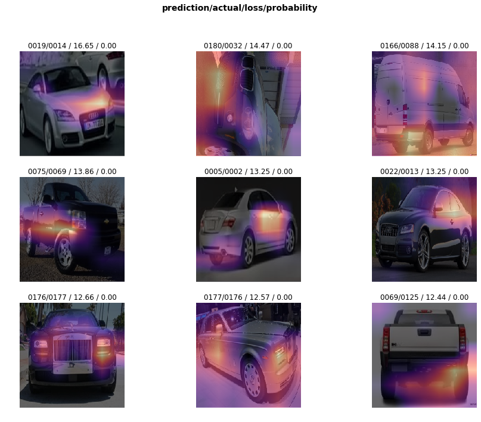
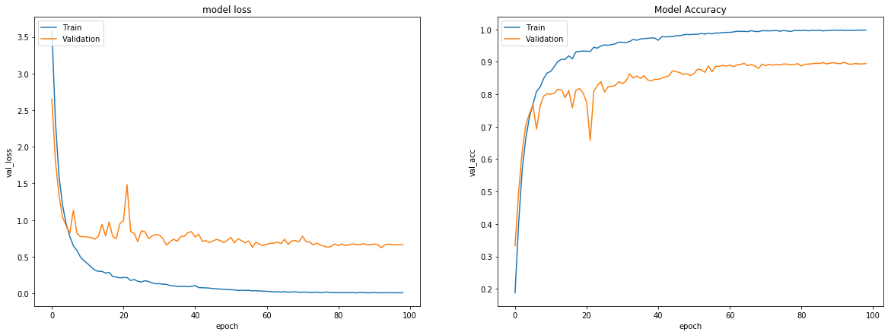

## Stanford Cars Classification Challenge

 This repo contains some of my experiments using the Stanford Cars dataset. The Cars dataset contains 16,185 images of 196 classes of cars. The data is split into 8,144 training images and 8,041 testing images, where each class has been split roughly in a 50-50 split. 

# Aim
The aim is to train a model that is best able to classify cars using the training set images.
This is a hard problem because some we have a large number of classes (196) and many classes have very few example images.

In the above figure you can see that some classes have as few as 20 images.
In particular Class 135 has the lowest image count (20) while  class 118 has highest no. of images (55). Most classes have around 33 image.
Below are some of the tough images. The trained model found it very hard to classify these images. The highlighted regions are Grad-CAM heatmaps.

 I mainly used fastai and Keras for my experiments. I used kaggle kernels which i will be publicly sharing. The notebooks directory contains the ipynb notebooks which you can download and run on your PC (you may have to replicate the folder structure). The python directory contains notebook code imported as python file.

# Things that worked:

1. Models

I experimented with EfficientNet Eb0,EB3, ResNext 50 and SeResNext. I found  ResNext 50 to work best (around 92.6 % test accuracy). SeResnext is slightly lacking. It gets accuracy of around 92.1% on the test set. I used fastai v1 for training. I found pretrained EB0's performance to be lacking compared to ResNext and SeResNext (around 91% test accuracy).
I also experimented with pretrained Xception and InceptionResNetV2 models available in Keras. I found their rate of convergance to be pretty slow so i didn't do exhaustive experiments.

I found fastai to be very useful for performing quick experiments. I trained ResNext50 model trained in 3 stages using the recommended progressive resizing approach:  128x128 -> 256*256 -> 299x299.

Here's the result of my best resnext 50 model

2. Augmentation Strategies

The networks seem to overfit and get 100% training set accuracy very quickly (after around 20 epochs,without any augmentations).
One has to be careful while choosing augmentations. Flipping image around X-avis doesn't make sense because then the road will be on top which doesn't make any semantic sense :-) The following Augmenations worked best for me.
* HorizontalFlip,rand_crop, d_zoom, max_lighting, symmetric_warp, CutOut and Mixup.

3. Focal Loss

Focal Loss helps prevents the vast number of easy negatives from overwhelming the classifier during training. You can read more about Focal loss [here](https://arxiv.org/abs/1708.02002).

4. Stochastic Weight Averaging and Cosine Annealing Schedule

SWA is an amazing technique which helps us improve the generalization capability of CNN without any further training cost. It basically averages the weights in last few epochs. 
I used Cosine Learning Rate Schedule to train my models. You can read more about this technique in Leslie Smith's paper.

5. Training using larger images

I found that using larger images for training seems to have a very big impact. EfficientNet EB0 trained with image size 150 gets around 86 % accuracy on test set. When the image size is increase to 224, the accuracy increases to 89 %. 

## What can be done to get even better results
You can use Stratified K fold cross validation to train K models on different subsets of data. This strategy allows us to ensemble the results.
You can go for training a second level model based on the OOF (out of fold) predictions of your CNN models. This can help you get better accuracy but this increases the model complexity. I wanted to find the best single model and I didn't want to use brute force, so I stayed away from this technique. But, you should surely give it a try if you desperately want to improve the accuracy.

You can also take a simple mean of thr raw prediction probabilities of different models i.e. seresnext, eb0,resnext. This should improve the results further. 

# The Notebooks
All the notebooks follow the same basic preprocessing steps. The provided folder structure is incompatible with keras ImageDataGenerator api. So, to reduce effort we first transform the dataset to bring it to our desired folder structure. You can find the code to get the data into a nice structure [here](https://github.com/foamliu/Car-Recognition/blob/master/pre-process.py).
Once this is done, we can start the modelling part. Pretrained EfficientNet weights are available in both keras and pytorch. I found the keras weights to give better results (91 %), so i am sharing the keras notebook here (pytorch version gave around 90 %). 
For my fastai experiments, I used pretrainedmodels library to get imagenet weights for senet,resnext,seresnext etc.

The repo currently contains the following notebooks. 
1. cars-se-resnext50-fastai

In this notebook, I train a Se Resnext 50 based image classifier using fastai library. It gets 92.2 % accuracy. You can run the code on Kaggle by forking this [notebook](https://www.kaggle.com/meaninglesslives/cars-se-resnext50-fastai)

2. cars-resnext50-32x4d-fastai

In this notebook, I train a Resnext 50 based image classifier using fastai library. It gets 92.6 % accuracy. You can run the code on Kaggle by forking this [notebook](https://www.kaggle.com/meaninglesslives/cars-resnext50-32x4d-fastai)

3. cars-eb0-keras

Recently Google unveiled EfficientNet which has fewer parameters but achieves SOTA accuracy in many many datasets. I was curious to see if EfficientNet works on this dataset. In this notebook you can see my experiment with the EB0 model using keras library. It gets an accuracy of around 91%. I did a cool GradCamcomparison of EfficientNet models with other state of the art models. You can find it [here](https://github.com/sidml/EfficientNet-GradCam-Visualization/). You can run the code on Kaggle by forking this [notebook](https://www.kaggle.com/meaninglesslives/cars-eb0-keras) 

4. cars-eb3-keras

This notebook trains image classifier using EB3 base model. Performance is slightly worser than EB0 based classifier and it takes longer time to train. You can run the code on Kaggle by forking this [notebook](https://www.kaggle.com/meaninglesslives/cars-eb3-keras) 

5. cars-dataset-visualization

This notebook contains code for generating PCA, TSNE and other visualizations of the cars dataset.
You can run the code on Kaggle by forking this [notebook](https://www.kaggle.com/meaninglesslives/cars-dataset-visualization) 
